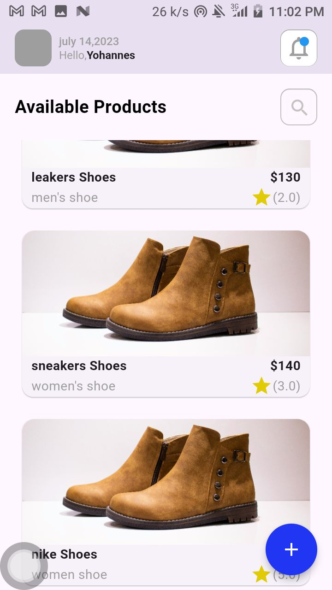
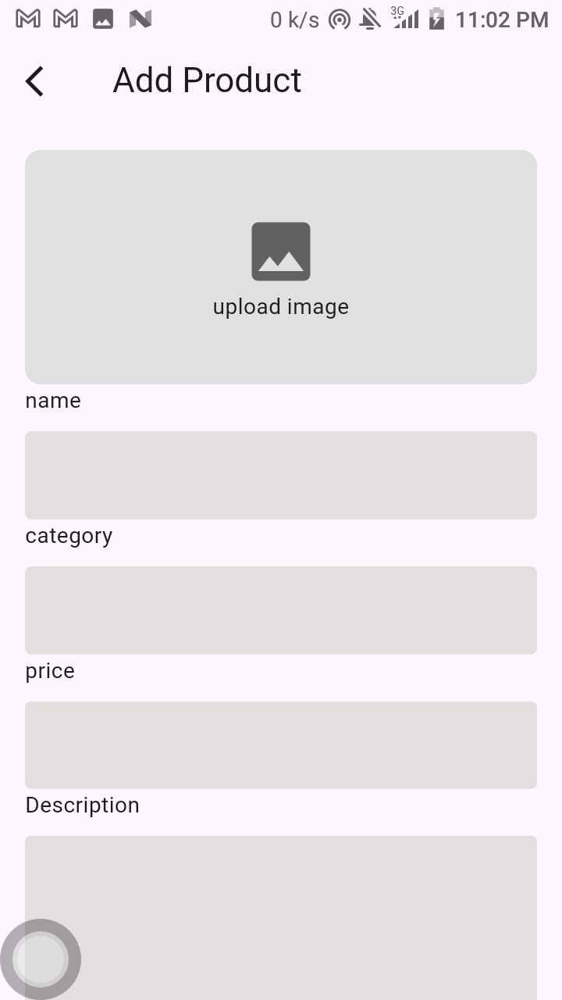

# ecommerce_app

A new Flutter project.

## Getting Started

This project is an ecommerce app implementation for customers to view leather brand shoes,add shoes brand, search and filter using prices and categories and finally view the shoes descriptions. 
The application is developed using flutter

